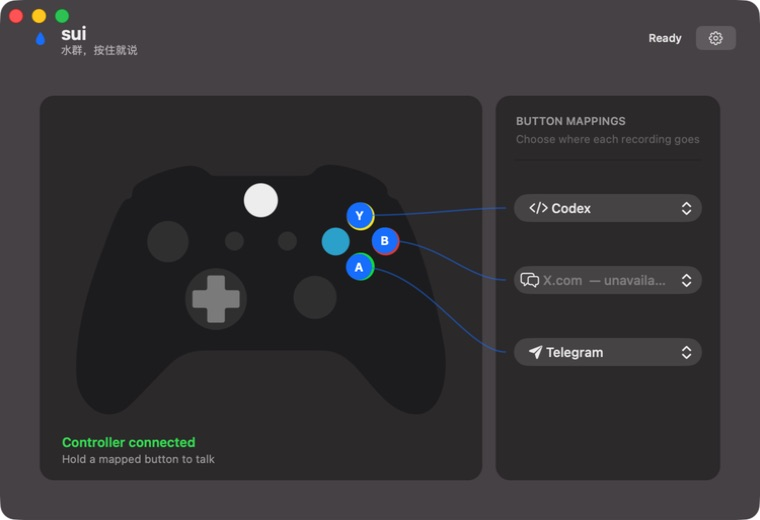
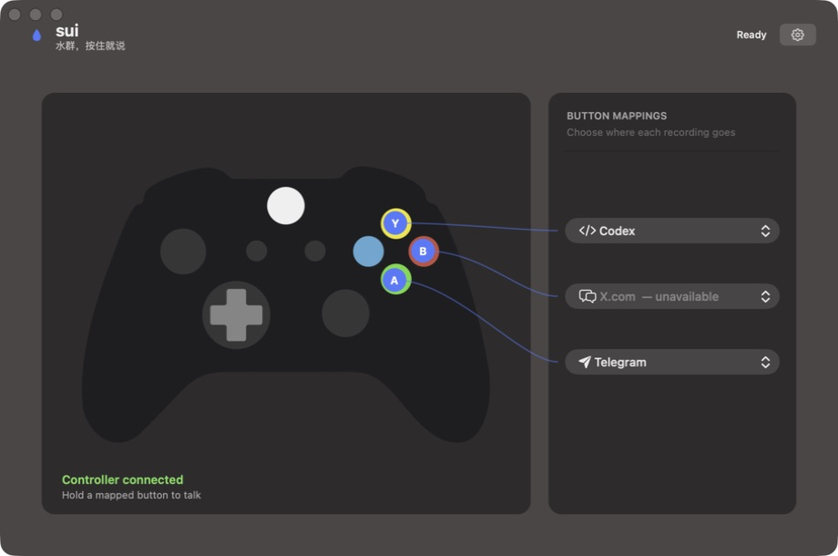
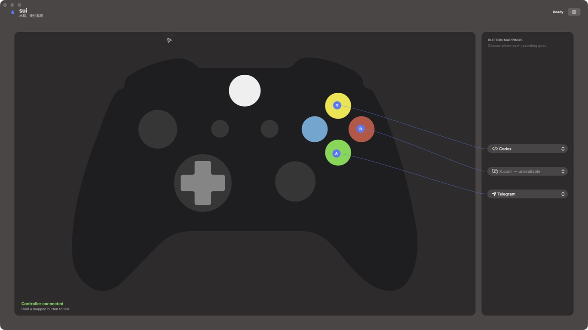
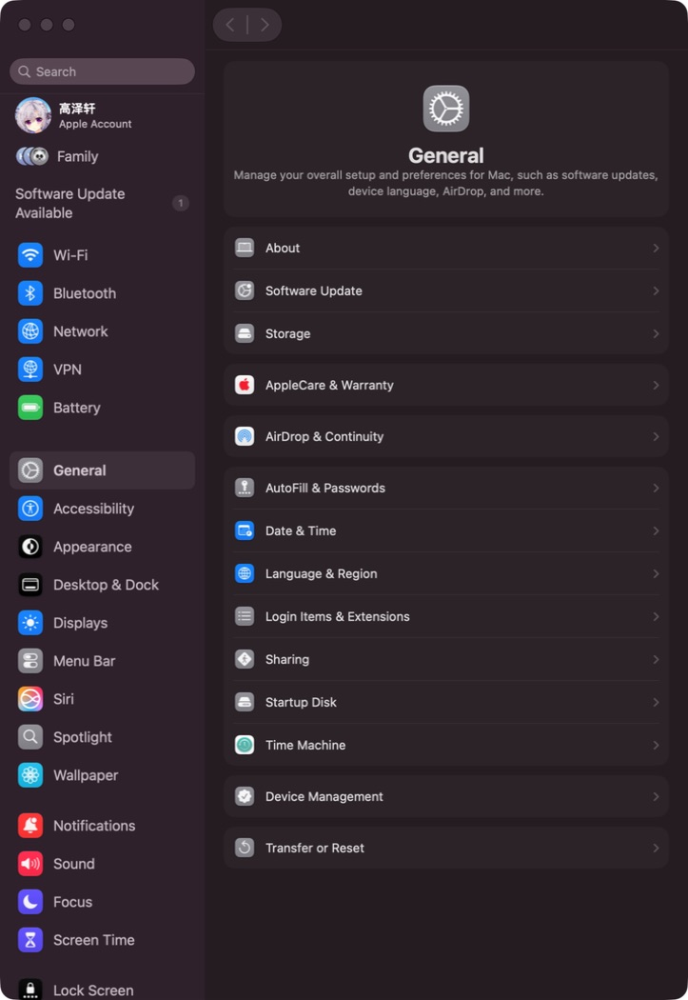

# V0.1 验收记录

日期：2026-08-12  
环境：macOS 27.0、Xcode 27.0、Apple Development Team `LT98S43NKA`

## 自动验证

- `xcodebuild` Debug 构建成功。
- 主 App、Native Messaging helper 与 Safari Web Extension 均被嵌入产物。
- `codesign --verify --deep --strict` 通过。
- App 签名 Authority 为 Apple Development，Team Identifier 为 `LT98S43NKA`，Hardened Runtime 为 27.0。

## Computer Use 验收

- App 能启动并显示唯一主窗口。
- 识别到 `Pro Controller`。
- A/B/Y 映射、用户提供的 EPS 矢量图与插件可用性灰置显示正常。
- EPS 白色画布已从 PostScript 绘制内容中移除，透明背景在真实 App 中通过。
- 主窗口在 760×520、920×610 与系统 Zoom 三档真实尺寸下完成截图检查；控件无裁切，连线端点随图像缩放。
- 设置在同一窗口切换，手柄下拉和三个插件开关可操作。
- X.com 插件开关完成一次 off → on 往返，状态正确恢复。
- 首次设置页展示麦克风、语音识别与辅助功能的真实授权状态。
- 签名产物含 `com.apple.security.device.audio-input`，系统麦克风列表已出现 `sui.app` 且开关开启。
- `sui.icns` 已嵌入 App bundle，系统列表显示水滴图标。

## 未自动执行

为避免向真实第三方会话发送内容，没有自动提交 Telegram/Codex 消息或 X 帖子。Telegram 已在真实首页状态检查：没有打开聊天时不存在 composer，符合“回到 sui 提示用户先打开聊天”的前置条件。Codex 出于 Computer Use 的安全限制不能由自动化读取；真实 PTT 发送仍留给明确的测试会话做人工端到端验收。
