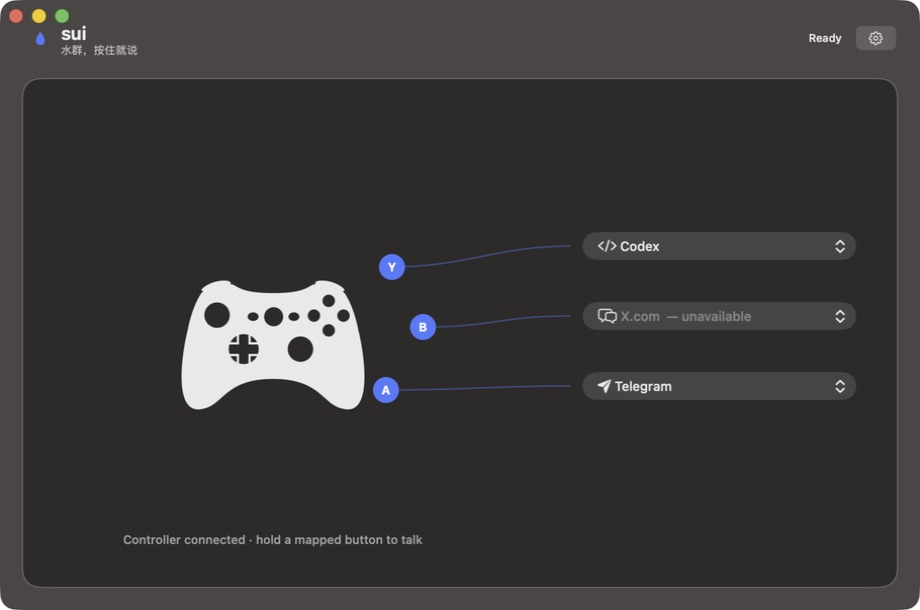
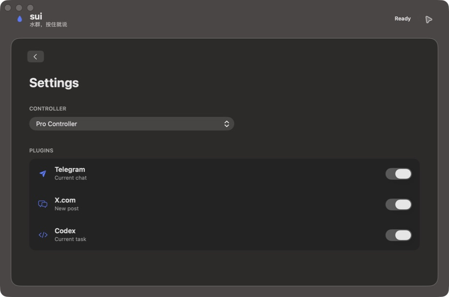

# V0.1 验收记录

日期：2026-08-12  
环境：macOS 27.0、Xcode 27.0、Apple Development Team `LT98S43NKA`

## 自动验证

- `xcodebuild` Debug 构建成功。
- 主 App、Native Messaging helper 与 Safari Web Extension 均被嵌入产物。
- `codesign --verify --deep --strict` 通过。
- App 签名 Authority 为 Apple Development，Team Identifier 为 `LT98S43NKA`，Hardened Runtime 为 27.0。

## Computer Use 验收

- App 能启动并显示唯一主窗口。
- 识别到 `Pro Controller`。
- A/B/Y 映射、外部 CC0 手柄矢量图与插件可用性灰置显示正常。
- 设置在同一窗口切换，手柄下拉和三个插件开关可操作。
- X.com 插件开关完成一次 off → on 往返，状态正确恢复。

## 未自动执行

为避免向真实第三方会话发送内容，没有自动提交 Telegram/Codex 消息或 X 帖子。语音权限弹窗和真实 PTT 发送留给明确的测试会话做人工端到端验收。

